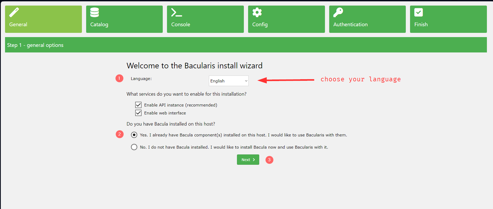
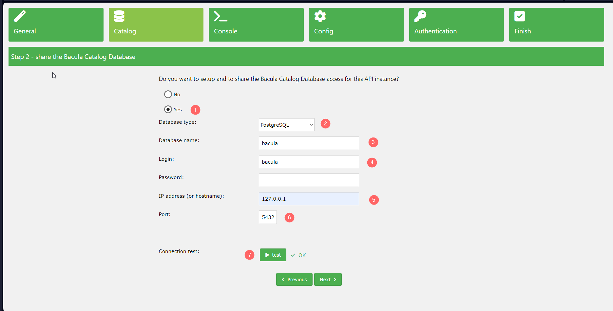
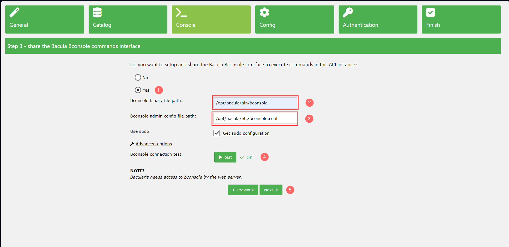
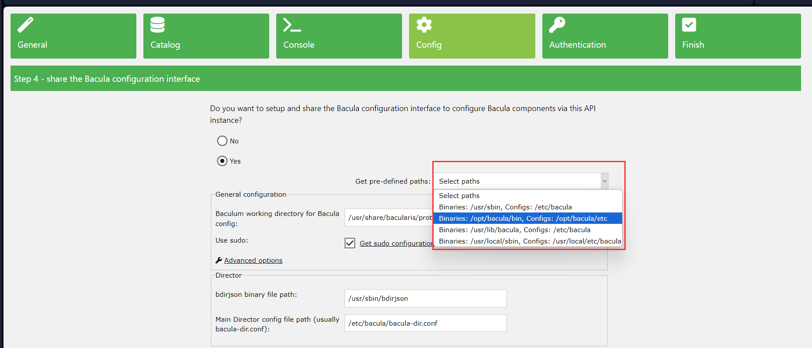
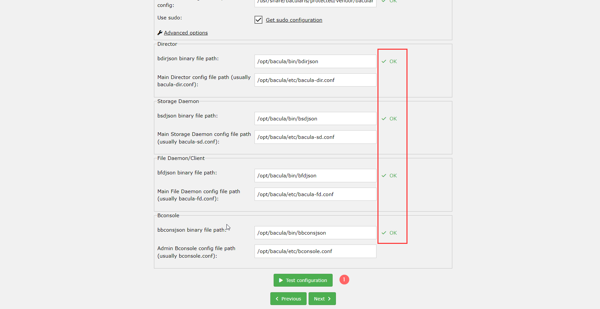
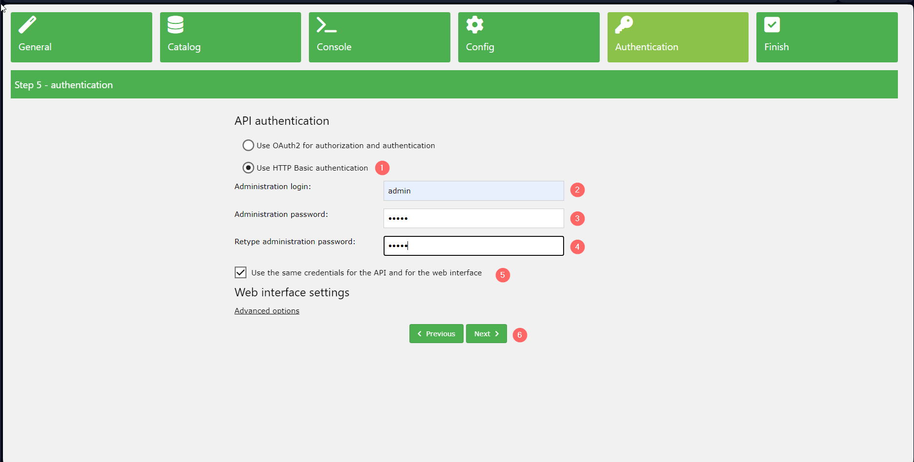
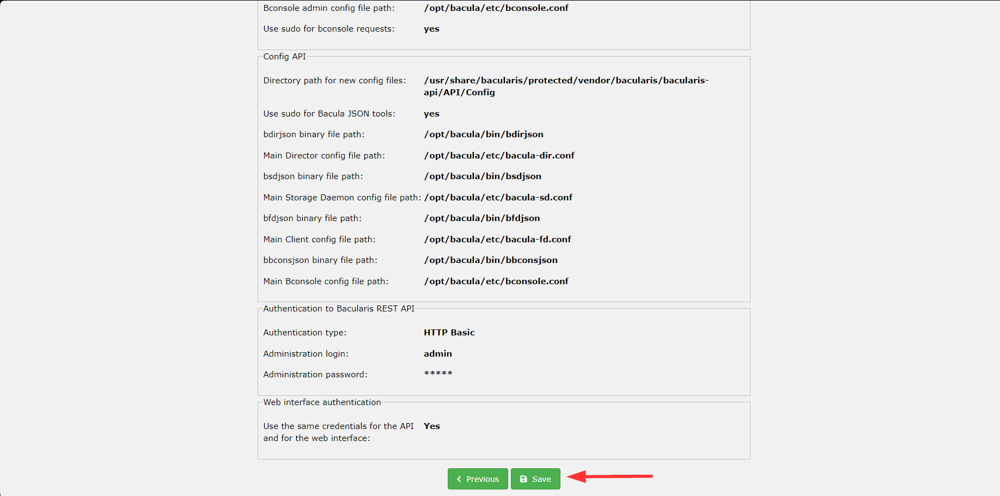
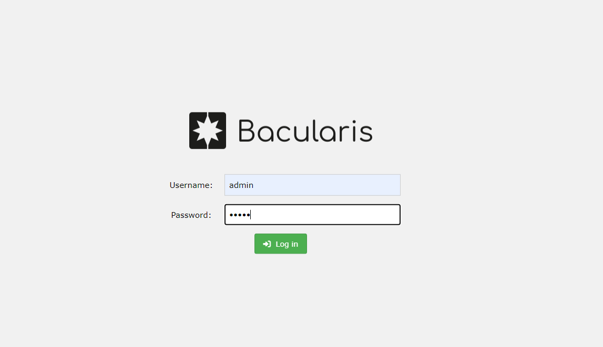
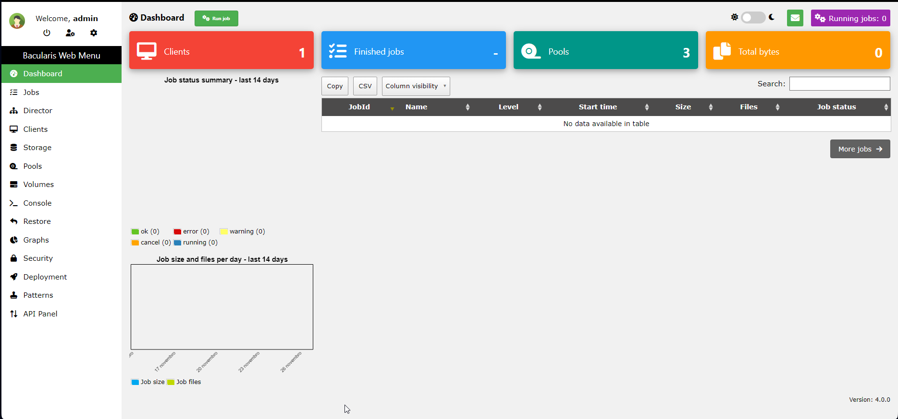

**Bacula Community Molinux Install** is approved in the following distributions and versions:

| Distro       | Version                       |
| :---         | :---                          |
| Debian       | 11 (bullseye)                 | 
| Oracle Linux | 9.3                           |
| Ubuntu       | 22.04.4 LTS (Jammy Jellyfish) | 
| Rocky        | Rocky Linux 9.3 (Blue Onyx)   |

<!-- Improved compatibility of voltar ao topo link: See: https://github.com/othneildrew/Best-README-Template/pull/73 -->
<a id="readme-top"></a>
<!--
*** Thanks for checking out the Best-README-Template. If you have a suggestion
*** that would make this better, please fork the repo and create a pull request
*** or simply open an issue with the tag "enhancement".
*** Don't forget to give the project a star!
*** Thanks again! Now go create something AMAZING! :D
-->

<!-- PROJECT SHIELDS -->
<!--
*** I'm using markdown "reference style" links for readability.
*** Reference links are enclosed in brackets [ ] instead of parentheses ( ).
*** See the bottom of this document for the declaration of the reference variables
*** for contributors-url, forks-url, etc. This is an optional, concise syntax you may use.
*** https://www.markdownguide.org/basic-syntax/#reference-style-links
-->
[![Contributors][contributors-shield]][contributors-url]
[![Forks][forks-shield]][forks-url]
[![Stargazers][stars-shield]][stars-url]
[![Issues][issues-shield]][issues-url]
[![MIT License][license-shield]][license-url]
[![LinkedIn][linkedin-shield]][linkedin-url]

<!-- PROJECT LOGO -->
<br />
<div align="center">
  <a href="https://github.com/othneildrew/Best-README-Template">
    
  </a>

  <h3 align="center">BCMI</h3>

  <p align="center">
    Bacula Community Molinux Install
    <br />
    <a href="https://github.com/molinux/bacula-tools/blob/master/bacula-install/README-pt_BR.md"><strong>Portugês »</strong></a>
    <a href="https://github.com/molinux/bacula-tools/blob/master/bacula-install/README-es.md"><strong>Español »</strong></a>
    <a href="https://github.com/molinux/bacula-tools/blob/master/bacula-install/README-en.md"><strong>English</strong></a>
    <br />
    <br />
    <a href="https://github.com/othneildrew/Best-README-Template">View Demo</a>
    ·
    <a href="https://github.com/othneildrew/Best-README-Template/issues/new?labels=bug&template=bug-report---.md">Report Bug</a>
    ·
    <a href="https://github.com/othneildrew/Best-README-Template/issues/new?labels=enhancement&template=feature-request---.md">Request Feature</a>
  </p>
</div>

<!-- TABLE OF CONTENTS -->
<details>
  <summary>Table of Contents</summary>
  <ol>
    <li>
      <a href="#about-the-project">About The Project</a>
      <ul>
        <li><a href="#built-with">Built With</a></li>
      </ul>
    </li>
    <li>
      <a href="#getting-started">Getting Started</a>
      <ul>
        <li><a href="#prerequisites">Prerequisites</a></li>
        <li><a href="#installation">Installation</a></li>
      </ul>
    </li>
    <li><a href="#usage">Usage</a></li>
    <li><a href="#roadmap">Roadmap</a></li>
    <li><a href="#contributing">Contributing</a></li>
    <li><a href="#license">License</a></li>
    <li><a href="#contact">Contact</a></li>
    <li><a href="#acknowledgments">Acknowledgments</a></li>
  </ol>
</details>

<!-- ABOUT THE PROJECT -->
## Sobre o Projeto

[![BCMI Screen Shot][product-screenshot]](https://example.com)

> Bacula Community Molinux Install (BCMI) é a ferramenta definitiva para instalar seu servidor Bacula Community (e ambiente).

---
Por que usar?

* Instalação automática com apenas alguns passos.
* Possibilidade de instalar componentes isolados (storage e/ou cliente).
* Instalação do Bacula e Bacularis centralizado.
* Documentação disponível em Português, Inglês e Espanhol.

<p align="right">(<a href="#readme-top">voltar ao topo</a>)</p>

<!-- GETTING STARTED -->
## Introdução

### Pré-requisitos

Para instalar o Bacula Community e/ou Bacularis usando o **BCMI**, você precisa criar uma conta em [bacula.org](https://www.bacula.org/bacula-binary-package-download/) and [bacularis.app](https://users.bacularis.com/user/login/) previamente e obter sua chave/conta/senha.

Depois disso, insira essas informações no arquivo bacula_molinux_install.conf como no exemplo abaixo:

```bash
bacula_key="69549348539sdvsd2623"
bacularis_user="sdfgh98ysdfgsdfg"
bacularis_pass="sdlfgsdfg-WEWERTBsdfsdfg"
```

Ou você pode especificar durante a instalação:

```bash
--------------------------------------------------
 Informe sua chave do Bacula
 Esta chave é obtida com o registro no site Bacula.org.
 https://www.bacula.org/bacula-binary-package-download/
 Por favor, insira sua chave do Bacula:
```

### Instalação

_Siga os passos abaixo para instalar e configurar sua aplicação:_

1. Crie sua conta em [bacula.org](https://www.bacula.org/bacula-binary-package-download/) e [bacularis.app](https://users.bacularis.com/user/login/).

2. Baixe o arquivo de configuração:

```sh
wget https://abre.ai/bacula-molinux-install-conf
```

3. Baixe o arquivo de instalação:

```sh
wget https://abre.ai/bacula-molinux-install-app
```

4. Insira suas credenciais no `arquivo bacula_molinux_install.conf`:

```bash
bacula_key="69549348539sdvsd2623"
bacularis_user="sdfgh98ysdfgsdfg"
bacularis_pass="sdlfgsdfg-WEWERTBsdfsdfg"
```

Ou você pode especificar isso durante a instalação:

```bash
--------------------------------------------------
 Informe sua chave do Bacula
 Esta chave é obtida com o registro no site Bacula.org.
 https://www.bacula.org/bacula-binary-package-download/
 Por favor, insira sua chave do Bacula:
```

5. Torne o arquivo `bacula_molinux_install-app` executável:

```bash
chmod +x bacula_molinux_install-app
```

6. Execute o instalador:

```bash
./bacula_molinux_install-app
```

<p align="right">(<a href="#readme-top">voltar ao topo</a>)</p>

<!-- USAGE EXAMPLES -->
## Uso

Após a instalação, você pode utilizar o `bconsole` para se conectar ao Bacula Director (server)

```bash
bconsole

Connecting to Director localhost:9101
1000 OK: 10002 bacula-dir Version: 15.0.2 (21 March 2024)
Enter a period to cancel a command.
*
```

E/ou configurar o Bacularis a partir do seu navegador

[![Bacularis API Screen Shot][bacularis-api-screenshot]](https://example.com)

<p align="right">(<a href="#readme-top">voltar ao topo</a>)</p>

# Bacularis Configuration



















<p align="right">(<a href="#readme-top">back to top</a>)</p>

<!-- ROADMAP -->
## Roadmap

* [x] README in English
* [ ] README in Brazilian Portuguese
* [ ] README in Spanish
* [ ] Bacula container version
* [ ] Bacularis container version
* [ ] Multi-language Support
  * [ ] Brazilian Portuguese
  * [ ] Spanish

Veja as [requisições abertas](https://github.com/molinux/bacula_molinux_install/issues) para uma lista completa de recursos propostos (e problemas conhecidos).

<p align="right">(<a href="#readme-top">voltar ao topo</a>)</p>

<!-- CONTRIBUTING -->
<!-- ## Contributing

Contributions are what make the open source community such an amazing place to learn, inspire, and create. Any contributions you make are **greatly appreciated**.

If you have a suggestion that would make this better, please fork the repo and create a pull request. You can also simply open an issue with the tag "enhancement".
Don't forget to give the project a star! Thanks again!

1. Fork the Project
2. Create your Feature Branch (`git checkout -b feature/AmazingFeature`)
3. Commit your Changes (`git commit -m 'Add some AmazingFeature'`)
4. Push to the Branch (`git push origin feature/AmazingFeature`)
5. Open a Pull Request

<p align="right">(<a href="#readme-top">voltar ao topo</a>)</p> -->

<!-- LICENSE
## License

Distributed under the MIT License. See `LICENSE.txt` for more information.

<p align="right">(<a href="#readme-top">voltar ao topo</a>)</p> -->

<!-- CONTACT -->
## Contato

Marcus Molinero - [linkedin](https://linkedin.com/in/marcus-molinero) - <marcus.molinero@bacula.com.br>

Project Link: [Bacula Community Molinux Install](https://github.com/molinux/bacula_molinux_install)

<p align="right">(<a href="#readme-top">voltar ao topo</a>)</p>

## Parcerias
<!-- <center> -->
<table>
 <tr>
        <td><a href="https://www.bacula.lat"></a></td>
        <td><a href="https://www.nomaland.com.br"></a></td>
 <tr>
</table>
 <!-- </center> -->

<p align="right">(<a href="#readme-top">voltar ao topo</a>)</p>

<!-- ACKNOWLEDGMENTS -->
<!-- ## Acknowledgments

Use this space to list resources you find helpful and would like to give credit to. I've included a few of my favorites to kick things off!

* [Choose an Open Source License](https://choosealicense.com)
* [GitHub Emoji Cheat Sheet](https://www.webpagefx.com/tools/emoji-cheat-sheet)
* [Malven's Flexbox Cheatsheet](https://flexbox.malven.co/)
* [Malven's Grid Cheatsheet](https://grid.malven.co/)
* [Img Shields](https://shields.io)
* [GitHub Pages](https://pages.github.com)
* [Font Awesome](https://fontawesome.com)
* [React Icons](https://react-icons.github.io/react-icons/search)

<p align="right">(<a href="#readme-top">voltar ao topo</a>)</p> -->

<!-- MARKDOWN LINKS & IMAGES -->
<!-- https://www.markdownguide.org/basic-syntax/#reference-style-links -->
[contributors-shield]: https://img.shields.io/github/contributors/othneildrew/Best-README-Template.svg?style=for-the-badge
[contributors-url]: https://github.com/othneildrew/Best-README-Template/graphs/contributors
[forks-shield]: https://img.shields.io/github/forks/othneildrew/Best-README-Template.svg?style=for-the-badge
[forks-url]: https://github.com/othneildrew/Best-README-Template/network/members
[stars-shield]: https://img.shields.io/github/stars/othneildrew/Best-README-Template.svg?style=for-the-badge
[stars-url]: https://github.com/othneildrew/Best-README-Template/stargazers
[issues-shield]: https://img.shields.io/github/issues/othneildrew/Best-README-Template.svg?style=for-the-badge
[issues-url]: https://github.com/othneildrew/Best-README-Template/issues
[license-shield]: https://img.shields.io/github/license/othneildrew/Best-README-Template.svg?style=for-the-badge
[license-url]: https://github.com/othneildrew/Best-README-Template/blob/master/LICENSE.txt
[linkedin-shield]: https://img.shields.io/badge/-LinkedIn-black.svg?style=for-the-badge&logo=linkedin&colorB=555
[linkedin-url]: https://linkedin.com/in/othneildrew
[product-screenshot]: assets/bcmi-001.png
[bacularis-api-screenshot]: assets/bcmi-002.png
[Next.js]: https://img.shields.io/badge/next.js-000000?style=for-the-badge&logo=nextdotjs&logoColor=white
[Next-url]: https://nextjs.org/
[React.js]: https://img.shields.io/badge/React-20232A?style=for-the-badge&logo=react&logoColor=61DAFB
[React-url]: https://reactjs.org/
[Vue.js]: https://img.shields.io/badge/Vue.js-35495E?style=for-the-badge&logo=vuedotjs&logoColor=4FC08D
[Vue-url]: https://vuejs.org/
[Angular.io]: https://img.shields.io/badge/Angular-DD0031?style=for-the-badge&logo=angular&logoColor=white
[Angular-url]: https://angular.io/
[Svelte.dev]: https://img.shields.io/badge/Svelte-4A4A55?style=for-the-badge&logo=svelte&logoColor=FF3E00
[Svelte-url]: https://svelte.dev/
[Laravel.com]: https://img.shields.io/badge/Laravel-FF2D20?style=for-the-badge&logo=laravel&logoColor=white
[Laravel-url]: https://laravel.com
[Bootstrap.com]: https://img.shields.io/badge/Bootstrap-563D7C?style=for-the-badge&logo=bootstrap&logoColor=white
[Bootstrap-url]: https://getbootstrap.com
[JQuery.com]: https://img.shields.io/badge/jQuery-0769AD?style=for-the-badge&logo=jquery&logoColor=white
[JQuery-url]: https://jquery.com
[Bash-url]: https://cdn.rawgit.com/odb/official-bash-logo/master/assets/Logos/Identity/PNG/BASH_logo-transparent-bg-color.png
